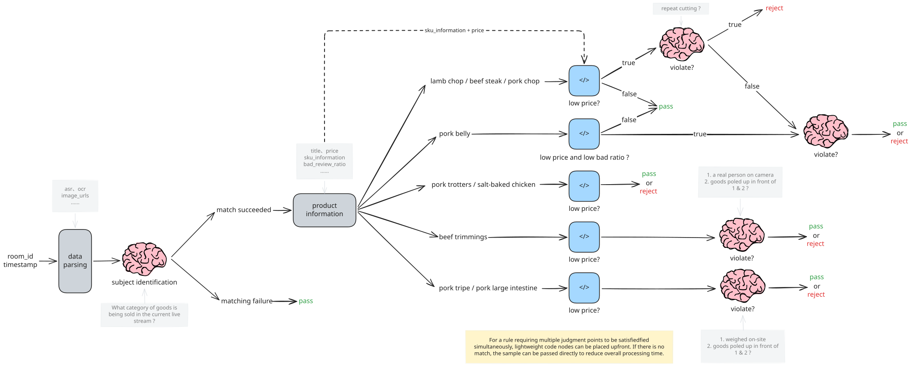

# Link1 · Single-Agent Unified Inspection

Pipeline 1: a single Agent owns all specialty inspections — Skills handle cloud-phone operations, SubAgents handle violation detection.

## Inspection Specialties

A total of 200 inspection specialties; the ones below are examples. Each specialty lives under [inspect_agent/](./inspect_agent) as its own directory with `skill.md` and `system_prompt.md`.

- [inspect_beef_and_egg_live](./inspect_agent/inspect_beef_and_egg_live) — Beef & Egg live inspection
- [inspect_pesticide_live](./inspect_agent/inspect_pesticide_live) — Pesticide live inspection
- [inspect_seed_product](./inspect_agent/inspect_seed_product) — Seed product inspection

## Subagent Workflow

At the agent level, a subagent is a lightweight agent with path-planning capability. Its execution graph is composed of three kinds of nodes — LLM nodes, code nodes, and tool nodes — that the planner routes between to carry out a single inspection task. The diagram below is an example (for `inspect_beef_and_egg_live`).

