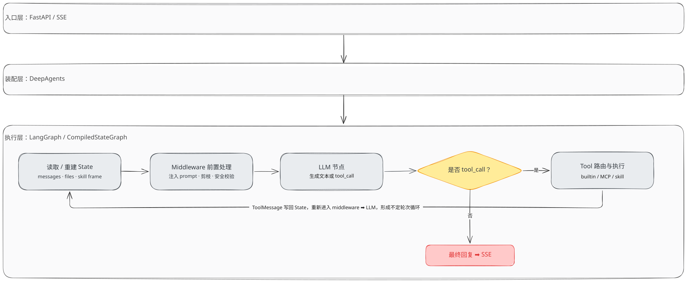
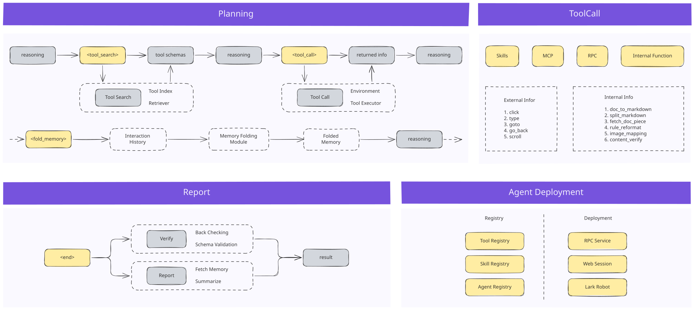

# Governance Assistant

Built on the **DeepAgents + LangGraph** unified workflow engine, focused on the Douyin e-commerce risk control vertical, to build a series of intelligent agents for Douyin e-commerce governance.

## Core Capabilities

- **Frontend automated inspection**: a reusable ADB device pool + uiautomator2 cloud-phone control Tool at the bottom, with Agent / SubAgent / Workflow / Skill designed per risk-control business on top, combined with multimodal LLMs to inspect live-stream and product compliance.
- **Long-context management**: to address context bloat in long-horizon inspections, a self-developed Skill Frame and IterResearch inspection memory layer provides context isolation and compression.

## Architecture

### Workflow Architecture

The runtime pipeline view: a request flows through the FastAPI/SSE entry, is assembled by DeepAgents, and executes on a LangGraph `CompiledStateGraph`. State passes through middleware pre-processing, the LLM node, and tool routing; tool results are written back to State to form the agentic loop.

### Module Architecture

The component view: the system is composed of Planning, ToolCall (Tool Index → Retriever → Tool Call → Tool Executor → Environment), and Memory Folding modules, backed by Tool/Skill/Agent registries and RPC/Web/Lark deployments.

## Inspection Pipelines

Frontend inspection evolves across two pipelines; see [Frontend_Inspection](./Frontend_Inspection):

- **[Link1](./Frontend_Inspection/Link1)**: a single Agent owns all specialty inspections — Skills handle cloud-phone operations, SubAgents handle violation detection.
- **[Link2](./Frontend_Inspection/Link2)**: refactored to "one specialty, one Agent", where operation-type and judgment-type Skills collaborate to replace the original SubAgent; an Elo-tournament-based self-iteration mechanism for judgment-type Skills is introduced to improve accuracy and maintainability.
